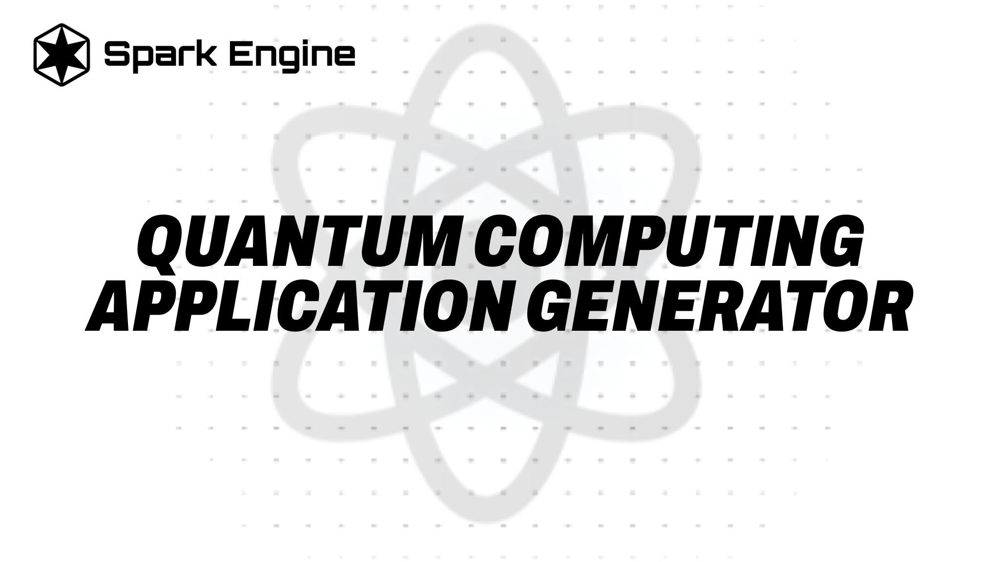

Here is the enhanced version of the README for the **Quantum Problem Solver with Circuit Design** project, styled similarly to the original README you provided:

---



# Quantum Problem Solver with Circuit Design

[](https://github.com/spark-engine-opensource-projects)
[](https://discord.gg/VAQA5c32jM)

## Overview

The **Quantum Problem Solver** is an innovative tool built with **Next.js**, designed to assist users in defining quantum computing problems and automatically generating quantum circuit designs using the **Spark Engine API**. The application is equipped with a dynamic user interface and backend integration that allows for seamless deployment to Vercel, making it highly scalable and efficient for real-world quantum problem-solving.

## Table of Contents

- [Features](#features)
- [Prerequisites](#prerequisites)
- [Installation](#installation)
- [Usage](#usage)
- [Project Structure](#project-structure)
- [API Usage](#api-usage)
- [Deployment Workflow](#deployment-workflow)
- [Error Handling](#error-handling)
- [Customization](#customization)
- [License](#license)
- [Acknowledgments](#acknowledgments)

## Features

- **Define Quantum Problems**: Choose from various quantum computing problem types (e.g., Optimization, Cryptography, Quantum Simulation) and customize objectives and application details.
- **Quantum Circuit Generation**: Automatically generate quantum circuit designs via the **Spark API** and display them in an interactive, structured format.
- **Dynamic UI**: Features an intuitive user interface with responsive components, collapsible sections, and loading indicators for real-time feedback.

## Prerequisites

Before running the Quantum Problem Solver, ensure you have the following:

- **Node.js** (v14.x or higher)
- **Next.js** (v12.x or higher)
- An account with [Spark Engine](https://sparkengine.ai) to obtain your Spark API key.
- A **Vercel account** for deploying the app (required for serverless API functions).

## Installation

1. **Clone the Repository:**

   ```bash
   git clone https://github.com/spark-engine-opensource-projects/quantum-computing-application-generator
   cd quantum-computing-application-generator
   ```

2. **Install Dependencies:**

   ```bash
   npm install
   # or
   yarn install
   ```

3. **Set Up Environment Variables:**

   You'll need to configure your Spark API key for the application. Create a `.env.local` file at the root of your project and add the following:

   ```bash
   SPARK_API_KEY=your-spark-api-key
   ```

## Usage

### Defining Quantum Problems

1. Start the application by running:

   ```bash
   npm run dev
   ```

2. Use the form to define your quantum computing problem, specifying problem types, subtypes, and objectives. The app will dynamically generate a quantum circuit based on the provided details.

3. The circuit design will be displayed, allowing you to review and further refine the problem or circuit as needed.

### API Usage

The app interacts with the **Spark API** to generate quantum circuits. The function `callSpark` in the `utils/spark.js` handles the communication between the app and the API. It sends the defined quantum problem data and processes the returned circuit information for display.

## Project Structure

- **`components/DefineProblem.js`**: Handles the user input for defining quantum problems (problem type, objectives, and more).
- **`components/QuantumCircuitDesign.js`**: Displays the quantum circuit design generated by the Spark API.
- **`pages/index.js`**: The main page that combines the problem definition and circuit design components.
- **`utils/spark.js`**: Contains the `callSpark` function, responsible for making API calls to SparkEngine.
- **`pages/api/callSpark.js`**: A serverless function that handles API requests from the frontend.

## Deployment Workflow

### Deploying to Vercel

This application requires deployment to Vercel to fully utilize the serverless API functions.

1. **Push the Project to GitHub**:

   Ensure the project is connected to a repository on GitHub, GitLab, or Bitbucket.

2. **Connect to Vercel**:

   Sign in to your Vercel account, connect the repository, and configure your **Spark API key** in the Vercel environment variables settings.

   ```bash
   SPARK_API_KEY=your-spark-api-key
   ```

3. **Deploy the Application**:

   Follow Vercel’s steps to deploy your project. Once deployed, the app will be live, and all serverless API routes will be functional.

## Error Handling

The app includes basic error handling, particularly for API calls. If the Spark API fails after three retries, a descriptive error message is displayed to the user.

### Retry Logic

If the Spark API call fails, the app attempts to retry up to three times before giving up and showing an error notification.

## Customization

You can extend or modify the app to fit additional requirements. For example:

- **Adding New Problem Types**: Update `DefineProblem.js` to include more quantum problem types or objectives.
- **UI Enhancements**: Adjust the styling and layout in the `components/` folder to create custom user experiences.

## License

This project is licensed under the MIT License. See the [LICENSE](./LICENSE) file for details.

## Acknowledgments

- **[Next.js](https://nextjs.org/)** for providing the framework to build this app.
- **[Spark Engine](https://sparkengine.ai)** for their quantum circuit generation API.

---

This enhanced README mirrors the polished style of your original project's documentation, ensuring consistency across both projects while maintaining clear and professional communication of essential details. Let me know if you need any more changes!